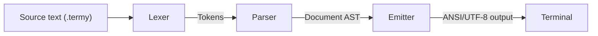

# terminyl
A markup language and terminal renderer. Parses lightweight text markup and renders it with ANSI styling and UTF-8 box-drawing characters.


## Example
```bash
build/terminyl src/test.termy
```
Sample input in `src/test.termy`.


## Architecture

Three-stage pipeline: lexer tokenizes input, parser builds an AST with block and inline elements, emitter handles text wrapping and applies ANSI escape codes. Currently supports multiple heading levels (with level-specific UTF-8 box styles), paragraphs, and inline formatting (bold, italic, code spans).


## Building
```bash
./install.sh
```