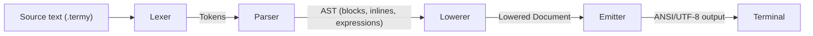

# terminyl
A terminal-first markup language and renderer. Parses lightweight text markup and renders it with ANSI styling and UTF-8 box-drawing characters.


Terminyl is evolving toward a programmable markup system, inspired by Typst, where expressions and control flow can generate document structure.

## Example
```bash
build/terminyl src/test.termy
```
Sample input in `src/test.termy`.

## Building
```bash
./install.sh
```

## Architecture

```mermaid
graph LR
    A["Source text (.termy)"] --> B["Lexer"]
    B -->|"Tokens"| C["Parser"]
    C -->|"AST (blocks, inlines, expressions)"| D["Lowerer"]
    D -->|"Lowered Document"| E["Emitter"]
    E -->|"ANSI/UTF-8 output"| F["Terminal"]
```
Terminyl uses a multi-stage pipeline:

- **Lexer**: converts source text into tokens
- **Parser**: builds a structured AST with block, inline, and expression nodes
- **Lowerer**: evaluates expressions and expands them into concrete document elements
- **Emitter**: handles layout, wrapping, and terminal styling

## Features

### Markup (implemented)
- Multi-level headings with UTF-8 box-drawing styles
- Paragraphs with word wrapping
- Inline formatting:
  - Bold (`*text*`)
  - Italic (`_text_`)
  - Code spans (`` `code` ``)

### Expressions (implemented, minimal)
- Inline expression splices using `#( … )`
- Numeric literals and `+` operator
- Expression results are evaluated and inserted into the document

#### Example
`Total: #(1+2)` renders as `Total: 3`.

### Expressions (planned)
- Variables and bindings
- Function calls

### Statements (planned)
- User defined functions/macros
- Iteration
- Control flow

## Design Goals

- Clear separation between parsing, evaluation, and rendering
- AST-driven architecture (no re-parsing of generated text)
- Incremental evolution from markup language to programmable document language
