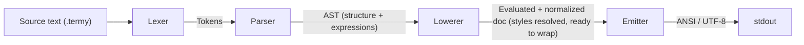
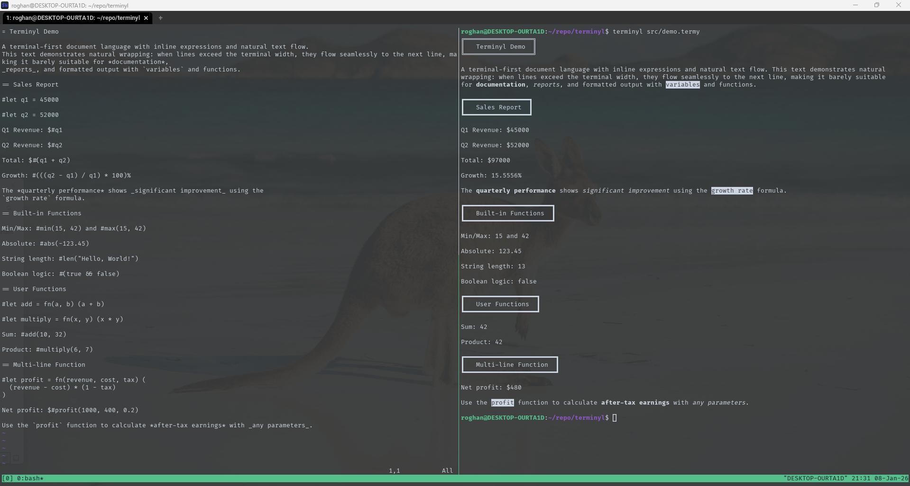
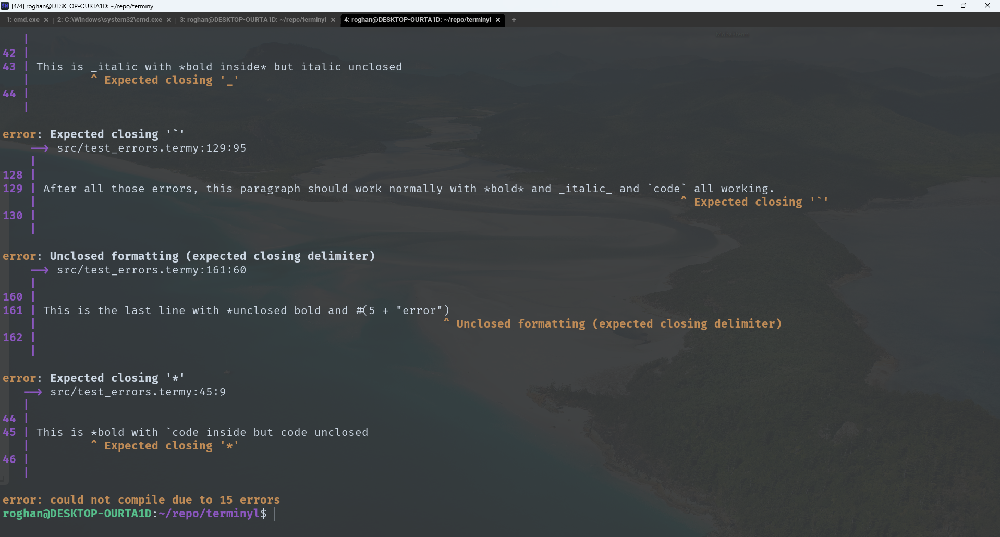

# terminyl
A terminal-first markup language and renderer with inline expressions, including first-class functions. It parses lightweight text markup and renders width-aware output using ANSI styling and UTF-8 box-drawing characters.

Terminyl is evolving toward a programmable markup system, inspired by Typst (meaning, I almost entirely lifted their syntax with only small deviations, e.g., functions are defined slightly differently), where expressions and control flow can generate document structure.

## Example
```bash
build/terminyl examples/demo.termy
```
Sample input in `examples/demo.termy`.

## Building

```bash
./install.sh
```
The only dependency is CMake.

## Architecture

```mermaid
graph LR
    A["Source text (.termy)"] --> B["Lexer"]
    B -->|"Tokens"| C["Parser"]
    C -->|"AST (structure + expressions)"| D["Lowerer"]
    D -->|"Evaluated + normalized doc (styles resolved, ready to wrap)"| E["Emitter"]
    E -->|"ANSI / UTF-8"| F["stdout"]

```
Terminyl uses a multi-stage pipeline:

- **Lexer**: converts source text into tokens
- **Parser**: builds a structured AST with block, inline, and expression nodes
- **Lowerer**: evaluates expressions and expands them into concrete document elements
- **Emitter**: handles layout, wrapping, and terminal styling

## Current Example



## Syntax

### Expressions

Inline expressions are evaluated and their results inserted into the document:
```
#(2 + 2)              // Arithmetic: +, -, *, /
#(x * 10)             // Variables
#(max(a, b))          // Function calls
#(arr[0])             // Array indexing
#((x + y) / 2)        // Parentheses for grouping
```

Operators follow standard precedence: `*` and `/` before `+` and `-`. Comparison operators (`<`, `>`, `<=`, `>=`, `==`, `!=`) and logical operators (`&&`, `||`, `!`) are also supported.

### Variables

Define variables with `#let`:
```
#let x = 42
#let name = "Alice"
#let items = [1, 2, 3]
```

Variables are scoped and can be referenced in expressions using `#(varname)`.

#### Assignment vs Definition

- **Definition** (`#let x = value`): Creates a new variable
- **Assignment** (`x = value`): Updates an existing variable (used in loops)
```
#let count = 0
#while count < 5 {
  count = count + 1    // Assignment
}
```

### Functions

Define functions using `fn`:
```
#let add = fn(a, b) (a + b)
#let double = fn(x) (x * 2)
```

Multi-line function bodies are supported:
```
#let calculate = fn(x, y) (
  (x + y) * 2
)
```

#### Calling Functions

Functions can be called in two ways:

1. **Inside expressions**: `#(max(a, b))` or `#(add(1, 2))`
2. **Direct syntax** (built-ins only): `#max(a, b)` or `#min(x, y)`

#### Built-in Functions

- `max(a, b)` - returns the larger value
- `min(a, b)` - returns the smaller value  
- `abs(x)` - returns absolute value
- `len(arr)` - returns array or string length
- `push(array, value, ...)` - returns new array with added elements (variadic)
- `pop(array)` - returns last element

### Arrays

Arrays support mixed types and are created with square brackets:
```
#let nums = [1, 2, 3, 4, 5]
#let names = ["Alice", "Bob", "Charlie"]
#let mixed = [42, "hello", true, [1, 2]]
```

Access elements with zero-based indexing, including negative indices:
```
#(nums[0])         // First element: 1
#(nums[-1])        // Last element: 5
#(names[1])        // "Bob"
```

Arrays are immutable - operations like `push` return new arrays:
```
#let arr = [1, 2]
#let arr = push(arr, 3)    // arr is now [1, 2, 3]
```

### Control Flow

#### While Loops
```
#let i = 0
#while i < 5 {
  [Iteration #(i)]
  i = i + 1
}
```

The loop body can contain:
- **Assignments**: `x = value` (updates existing variables)
- **Markdown literals**: `[content]` (generates document output)

Loop conditions can use comparison (`<`, `>`, `<=`, `>=`, `==`, `!=`) and logical operators (`&&`, `||`).

### Markdown Literals

Inside control flow blocks, wrap output in square brackets to create formatted paragraphs:
```
#while i < len(items) {
  [Item #(i): *#(items[i])* is `important`]
  i = i + 1
}
```

Markdown literals support:
- **Inline formatting**: `*bold*`, `_italic_`, `` `code` ``
- **Expressions**: `#(variable)` or `#(expression)`
- **Text and punctuation**: Mixed freely with formatting


### Data Types

- **Numbers**: `42`, `3.14`, `-5`
- **Strings**: `"hello"`, `"world"` (double quotes)
- **Booleans**: `true`, `false`
- **Arrays**: `[1, 2, 3]`, `["a", "b"]`
- **Functions**: `fn(x) (x * 2)`
- **Null**: `none` 

## Error Reporting
The document compiler features helpful, pretty error messages with:
- Precise source locations with line and column numbers
- Colour-coded by severity (red for errors, yellow for warnings)
- Source context with the offending line and surrounding code
- Arrows pointing to exact error positions




## Design Goals

- Clear separation between parsing, evaluation, and rendering
- AST-driven architecture (no re-parsing of generated text)
- Incremental evolution from markup language to programmable document language
