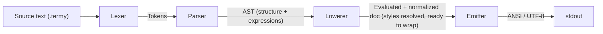
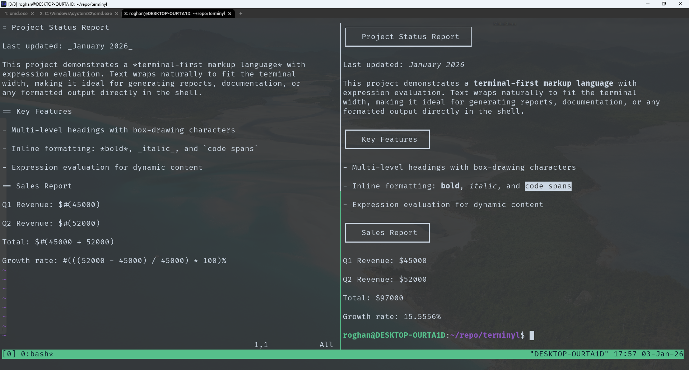

# terminyl
A terminal-first markup language and renderer with inline expressions, including first-class functions. It parses lightweight text markup and renders width-aware output using ANSI styling and UTF-8 box-drawing characters.

Terminyl is evolving toward a programmable markup system, inspired by Typst, where expressions and control flow can generate document structure. The last major missing piece is control flow.

## Example
```bash
build/terminyl src/demo.termy
```
Sample input in `src/demo.termy`.

## Building
```bash
./install.sh
```

## Architecture

```mermaid
graph LR
    A["Source text (.termy)"] --> B["Lexer"]
    B -->|"Tokens"| C["Parser"]
    C -->|"AST (structure + expressions)"| D["Lowerer"]
    D -->|"Evaluated + normalized doc (styles resolved, ready to wrap)"| E["Emitter"]
    E -->|"ANSI / UTF-8"| F["stdout"]

```
Terminyl uses a multi-stage pipeline:

- **Lexer**: converts source text into tokens
- **Parser**: builds a structured AST with block, inline, and expression nodes
- **Lowerer**: evaluates expressions and expands them into concrete document elements
- **Emitter**: handles layout, wrapping, and terminal styling

## Current Example



## Features

### Error Reporting

The document compiler features helpful, pretty error messages with:
- Precise source locations with line and column numbers
- Colour-coded by severity (red for errors, yellow for warnings)
- Source context with the offending line and surrounding code
- Arrows pointing to exact error positions


### Markup (implemented)
- Multi-level headings with UTF-8 box-drawing styles
- Paragraphs with word wrapping
- Inline formatting:
- Bold: `*text*`
- Italic: `_text_`
- Code spans: ``  `text`  ``

### Expressions (implemented)
- Inline expression splices using `#( … )`
- Numeric literals and basic binary operators (+, -, *, /, ==, >=, <=, !=, >)
- Expression results are evaluated and inserted into the document
- Variables and bindings
- Builtin functions
- User defined functions

### Statements (planned)
- Control flow

## Design Goals

- Clear separation between parsing, evaluation, and rendering
- AST-driven architecture (no re-parsing of generated text)
- Incremental evolution from markup language to programmable document language
